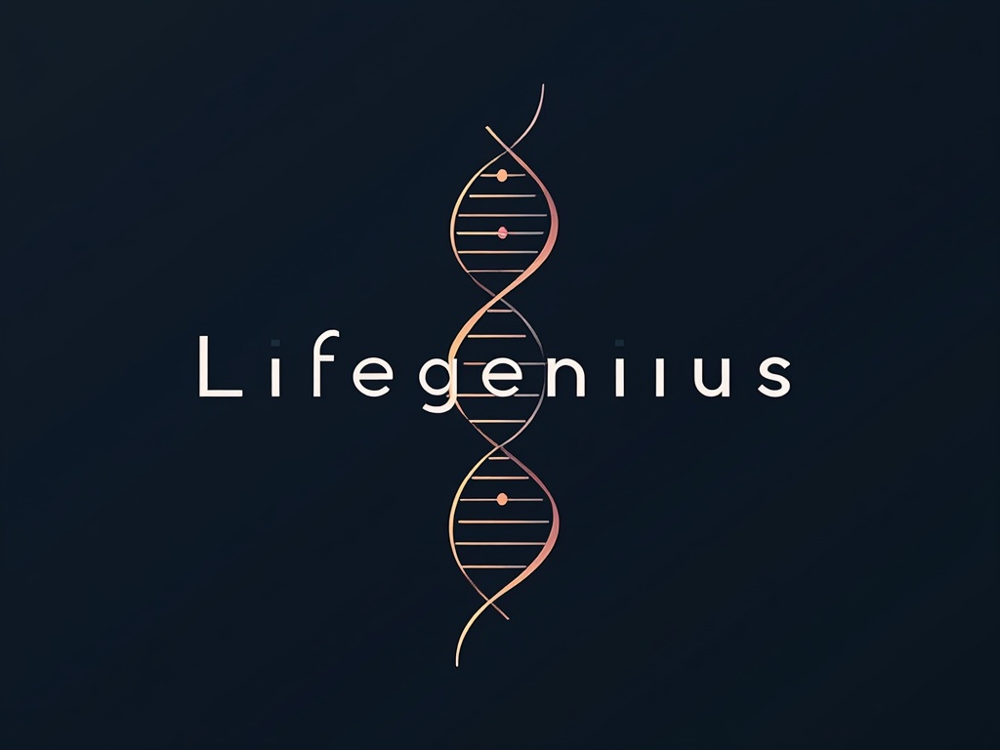

# Lifegenius - 遺伝子とAIが導く、パーソナライズド・ライフデザイン

[](https://opensource.org/licenses/MIT)
[](https://travis-ci.org/your-repo/lifegenius)
[](https://semver.org)
[](https://github.com/prettier/prettier)

<p align="center">
  
</p>

## 概要

🧬🧠 Lifegeniusは、遺伝子とAIを融合し、あなたの潜在能力を解き放つパーソナライズド・ライフデザインプラットフォームです。自己発見から生涯にわたる成長まで、あなたの人生を豊かにします。

## ミッション

遺伝子データとAIの力を活用し、一人ひとりの潜在能力を最大限に引き出し、自己実現をサポートすることで、より豊かな人生を送れる社会を実現する。

## ビジョン

パーソナライズド・ライフデザインのリーディングカンパニーとして、人々が自らの可能性を最大限に開花させ、幸福な人生を送るためのインフラとなる。

## 特徴

*   🧬 **科学的根拠に基づくパーソナライズ:** 遺伝子検査結果とAI分析を組み合わせ、客観的で精度の高い自己分析を提供。
*   📚 **最適化された学習体験:** 遺伝的特徴と学習進捗に基づいた個別カリキュラムで、効率的かつ効果的な学習を実現。
*   🎯 **最適なキャリアパス提案:** 遺伝的傾向、興味関心、スキルを総合的に分析し、最適なキャリアパスを提示。
*   💪 **生涯にわたる成長サポート:** 学習、キャリア、健康、ウェルネスまで、人生のあらゆる側面を包括的に支援。
*   📊 **データに基づいた意思決定:** 分析結果を分かりやすく可視化し、データに基づいた意思決定をサポート。
*   🔄 **継続的なアップデート:** 最新の研究成果や技術動向を反映し、常に最適なサービスを提供。

## 主な機能

*   **DNA解析 & AI特性分析:**
    *   提携機関による高精度な遺伝子検査
    *   遺伝子データ、行動データ、興味関心、学習データなどを統合的に分析
    *   深層学習、自然言語処理などを活用したAIによる特性分析
    *   個人の強み・弱み、潜在能力、最適な学習スタイルなどを明確化
*   **パーソナライズドレポート:**
    *   分析結果を分かりやすく可視化したレポートを提供
    *   専門家による解説やアドバイス付き
*   **最適化学習プログラム:**
    *   遺伝的特徴に基づいた最適な学習スタイルを提案 (視覚優位、聴覚優位など)
    *   AI駆動の個別カリキュラム作成 (学習内容と難易度を動的に調整)
    *   進捗モニタリングと計画調整
    *   オンライン学習リソース、学習コミュニティへのアクセス提供
*   **キャリアデザインサポート:**
    *   適性診断と職業マッチング
    *   スキル開発ロードマップ
    *   キャリアシミュレーション
    *   キャリアカウンセリング、人材紹介サービスとの連携
*   **健康・ウェルネス連携サービス:**
    *   健康管理アプリ、フィットネストラッカーとの連携
    *   遺伝的リスクに基づいたパーソナライズド健康アドバイス、運動プログラム
    *   メンタルヘルスサポート、ストレスマネジメント情報提供

## 技術スタック

*   **フロントエンド:** React, Next.js, Tailwind CSS
*   **バックエンド:** Python (Flask/Django), Node.js
*   **データベース:** PostgreSQL, MongoDB
*   **AI/機械学習:** OpenAI API, TensorFlow, PyTorch, scikit-learn
*   **バイオインフォマティクス:** Biopython, பிற ஓப்பன் சோர்ஸ் நூலகங்கள்
*   **クラウドプラットフォーム:** GCP
*   **API連携:** 検査機関API, 教育プラットフォームAPI, キャリアマッチングプラットフォームAPI, 健康・ウェルネスサービスAPI

## プロジェクト構成

lifegenius/
├── client/             # フロントエンドアプリケーション (React, Next.js)
│   ├── public/
│   ├── src/
│   │   ├── components/
│   │   ├── pages/
│   │   ├── styles/
│   │   └── utils/
│   └── ...
├── server/             # バックエンドアプリケーション (Python/Node.js)
│   ├── app/            # アプリケーションのコアロジック
│   │   ├── models/
│   │   ├── routes/
│   │   ├── services/
│   │   └── utils/
│   ├── tests/          # テストコード
│   └── ...
├── data/               # データ関連ファイル (サンプルデータ、データセットなど)
├── scripts/            # 各種スクリプト (データ処理、バッチ処理など)
├── docs/               # プロジェクトドキュメント
├── .env.example        # 環境変数のサンプル
├── .gitignore
├── package.json        # プロジェクトの依存関係 (Node.js)
├── requirements.txt    # プロジェクトの依存関係 (Python)
├── README.md           # このREADMEファイル
└── ...

## 開発環境構築

### 前提条件

*   Node.js (v14+)
*   npm / yarn
*   Python (v3.8+)
*   pip
*   Docker

### 手順 (Docker 推奨)

Docker を利用することで、より簡単に開発環境を構築できます。

1. **Docker Compose ファイルの作成:**

    プロジェクトルートに `docker-compose.yml` ファイルを作成し、以下の内容を記述します。

    ```yaml
    version: "3.8"
    services:
      client:
        build: ./client
        ports:
          - "3000:3000"
        volumes:
          - ./client:/app
          - node_modules:/app/node_modules
        environment:
          - NODE_ENV=development
      server:
        build: ./server
        ports:
          - "5000:5000"
        volumes:
          - ./server:/app
        environment:
          - PYTHONUNBUFFERED=1
    ```

2. **Docker Compose で起動:**

    ```bash
    docker-compose up -d
    ```

### 手順 (通常)

1. **リポジトリのクローン:**

    ```bash
    git clone [無効な URL を削除しました]
    cd lifegenius
    ```

2. **フロントエンドのセットアップ:**

    ```bash
    cd client
    yarn install # または npm install
    yarn dev # または npm run dev
    ```

3. **バックエンドのセットアップ:**

    ```bash
    cd ../server
    python3 -m venv venv
    source venv/bin/activate # Windows: venv\Scripts\activate
    pip install -r requirements.txt
    python manage.py runserver # または適切な起動コマンド
    ```

4. **環境変数の設定:**

    `.env.example` を参考に `.env` ファイルを作成し、必要な環境変数を設定してください。

5. **データベースのセットアップ:**

    選択したデータベース (PostgreSQL, MongoDBなど) をインストールし、設定してください。

## テストの実行

```bash
# フロントエンドのテスト
cd client
yarn test # または npm run test

# バックエンドのテスト
cd ../server
source venv/bin/activate # Windows: venv\Scripts\activate
pytest
```

貢献方法
プロジェクトへの貢献は大歓迎です！貢献する前に、[CONTRIBUTING.md](CONTRIBUTING.md) (作成予定) をご覧ください。

リポジトリをフォークします。
機能ブランチを作成します (git checkout -b feature/AmazingFeature)。
変更をコミットします (git commit -m 'Add some AmazingFeature')。
ブランチをプッシュします (git push origin feature/AmazingFeature)。
プルリクエストを開きます。

ライセンス
このプロジェクトは MIT License のもとでライセンスされています。

連絡先
プロジェクトリーダー: [あなたの名前] - [あなたのメールアドレス]
プロジェクトウェブサイト: [プロジェクトのウェブサイトURL](作成予定)

ロードマップ
フェーズ1 (6ヶ月):
プロトタイプ開発
提携検査機関との契約締結
β版サービス開始
フェーズ2 (12ヶ月):
サービス本格展開
マーケティング活動強化
ユーザー獲得
フェーズ3 (18ヶ月):
サービス拡充
企業・教育機関向けプラン提供
グローバル展開準備
